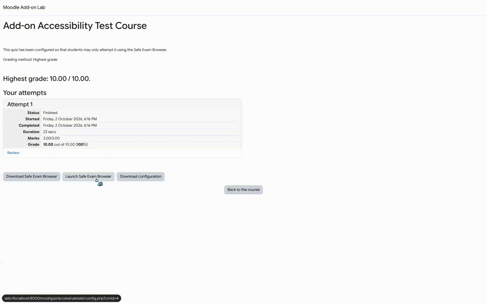
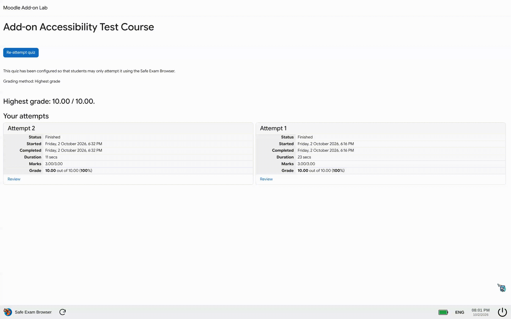
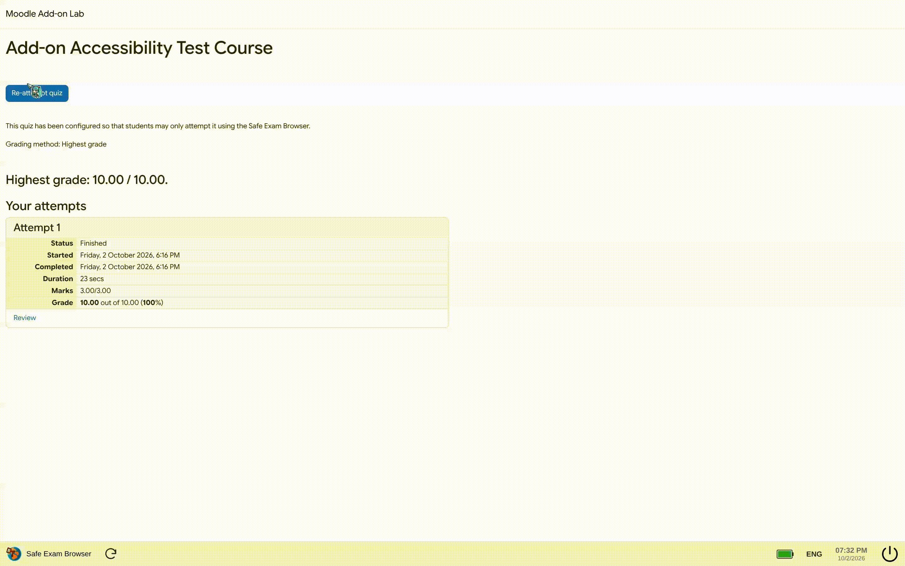

# OEB - Open Exam Browser

A lightweight, open-source browser extension that helps open and handle Safe Exam Browser (.seb) exam packages in Chromium and Firefox, with optional AI-powered Moodle question autofill.

This project is largely based on the work of [UmmItKin/SebBypass](https://github.com/UmmItKin/SebBypass) and builds on the archived upstream work from [cycyrild/SebBypass](https://github.com/cycyrild/SebBypass).

## Why OEB?

- Open `.seb` files and follow SEB launch links directly in your browser.
- Works on Windows, macOS, and Linux, with Chromium and Firefox support.
- Includes the startup experience, exam progress flow, and a more realistic SEB-style browser bar.
- Adds optional Moodle AI autofill for supported questions via OpenAI, Gemini, and other providers.

## Preview

<table>
  <tr>
    <td align="center">
      
      <br />Startup flow
    </td>
    <td align="center">
      
      <br />Shutdown dialog
    </td>
  </tr>
  <tr>
    <td colspan="2" align="center">
      
      <br />AI question autofill
    </td>
  </tr>
</table>

## Features

### Core browser experience
- Open `.seb` files and follow exam launch links.
- Runs in both Chromium and Firefox, including Firefox 128+.
- Shows startup animation and a loading progress flow.
- Emulates a realistic SEB shutdown prompt and browser chrome.

### Moodle AI autofill
- Fill Moodle quiz questions with AI using OpenAI, Google Gemini, or other configured providers.
- Supports multiple providers and models.
- Saves API keys locally in the browser for convenience.
- Provides keyboard shortcuts:
  - `Strg+Shift+Y` to autofill
  - `Strg+Shift+X` to move to the next question

> Questions with images are not fully supported in all cases; in those situations, opening the external AI site may still be the most reliable option.

## Project structure

- `source/`: editable extension source
  - `seb/`: SEB browser behavior and assets
  - `assistant/`: AI autofill logic
- `release/chrome/`: ready-to-load Chromium extension build
- `release/firefox/`: ready-to-load Firefox extension build

Both release folders share the same codebase; only the browser-specific `manifest.json` differs.

## Installation

### Using the release builds
The release folders already contain the correct `manifest.json`, so you generally do not need to rename anything.

### Loading in Chromium
- Use a Chromium-based browser that still supports Manifest V2, such as [Helium](https://helium.computer/).
- Open `chrome://extensions`.
- Enable **Developer mode**.
- Click **Load unpacked** and select `release/chrome/`.

### Loading in Firefox
- Open `about:debugging#/runtime/this-firefox`.
- Choose **Load Temporary Add-on**.
- Select `release/firefox/manifest.json`.
- Note: temporary add-ons are removed when Firefox closes; permanent installation requires Mozilla signing.

### Loading the source directly
If you want to work from the source tree instead, rename the appropriate manifest inside `source/`:

- Chromium: rename `chrome.manifest.json` to `manifest.json`
- Firefox: rename `firefox.manifest.json` to `manifest.json`

When switching between browsers in `source/`, restore the previous manifest name before renaming the next one.

> Shortcuts may need to be reconfigured in the browser extension settings after loading.

## Usage

1. Open a `.seb` file or follow a SEB launch link.
2. For AI autofill, enable the current domain and add your API key/model in the extension settings.
3. Save your provider configuration and select **Ask AI & fill** when needed.
4. Use the extension only in environments where it is permitted.

API keys are stored locally. Autofill sends the relevant question content and images to the selected provider. Unlock passwords are not stored.

## Rebuild releases

Run the following from this folder:

```bash
npm install
npm run build
```

This rebuilds both browser release directories, minifies the JavaScript and CSS, and ensures the correct `manifest.json` is included in each output.

## Disclaimer

This software is provided "as is" without warranty of any kind. Use it responsibly and only in accordance with applicable laws and regulations. The developers are not responsible for misuse or consequences arising from its use. Users are solely responsible for ensuring their use complies with all relevant rules, standards, and institutional policies.

## Important note

# Cheating during exams does not make you smarter; it makes you a cheater.
